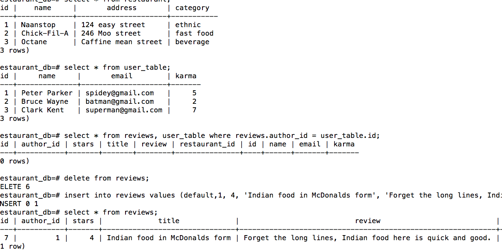

# postgresqlExercises
# Objectives
* essential sql commands (create, drop, select, insert, etc.)
* join referenced primary keys from different tables together

###Finished both exercises and began attempt at bonus challenge to create restaurnat review collection

